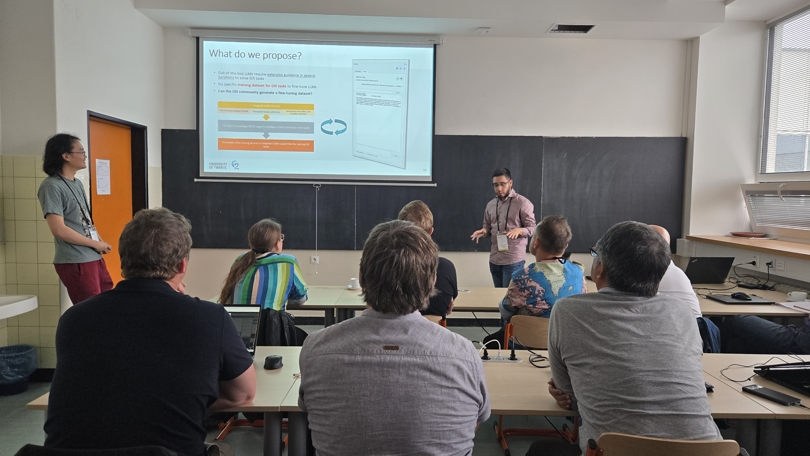

# Blog Posts

## Workshop at [QGIS User Conference 2024](https://uc2024_qgis_sk_) in Bratislava

In a [workshop](https://talks.osgeo.org/qgis-uc2024/talk/DNHKHQ/) at QGIS User Conference 2024, the **IntelliGeo** plugin was presented to the QGIS user community. We had a full room of interested people actively participating in the workshop. The workshop was started with an introduction to the IntelliGeo plugin and it's relation with AI/LLMs. Then the participants installed IntelliGeo, participated in a hands-on activity where they use the plugin to perform different GIS tasks. Finally, we had a very constructive feedback round where we collected amazing suggestion and collaboration opportunities. 

Some nice images from the workshop:

<table>
  <tr>
    <td rowspan="2" colspan="2">
    </td>
    <td>
    </td>
  </tr>
  <tr>
    <td></td>
  </tr>
  <tr>
    <td></td>
    <td></td>
    <td></td>
  </tr>
</table>

## **IntelliGeo** at ICT Open 2024

IntelliGeo project was presented at NWO ICT.OPEN2024 which was held in Jaarbeurs Utrecht, 10 and April 2024. The title of the presentation by [Mahdi]() and [Gustavo]() was **"Fine-Tuning LLMs for Spatial Analysis and Modeling – An Initial Step"**. 

**The abstract of the talk:**

Geospatial Information Science (GIScience) combines Geography, Earth Science, and Computer Science to develop methods for handling geographical data such as satellite/UAV imagery and GPS observations, aiding in complex model building using Geographical Information System (GIS) platforms in sectors like climate change, food security, and health. The intersection of GIScience and recent advances in Large Language Models (LLMs) presents an opportunity to transform spatial analysis and modelling. However, the integration of LLMs into GIScience applications is hindered by the absence of fine-tuning datasets for spatial analysis and modelling tasks, thus a lack of task-specific LLMs in the GIScience domain. In response, we are working on a research project funded by the NWO Ai NED program to integrate general-purpose LLMs into QGIS, a widely used GIS platform. The main idea is to record expert user interactions with an out-of-the-box, general-purpose LLM. Since the LLM is not specialized for GIS tasks, users will need to interact with it iteratively to solve the GIS tasks. We hypothesize that recording such interactions will allow us to build a community-based specialized dataset to fine-tune LLMs for spatial analysis and modelling. This presentation will explain the main objectives of the project, its primary results, and the remaining steps. We will showcase our initial findings about the effective mechanisms to translate users’ analytical descriptions into executable geoprocessing workflows in GIS. Primary results affirm the capacity of the proposed approach to democratize spatial analysis by embedding advanced Artificial Intelligence within GIS platforms.

**Keywords:** LLM, GIS, Fine-tuning, Dataset, Spatial

