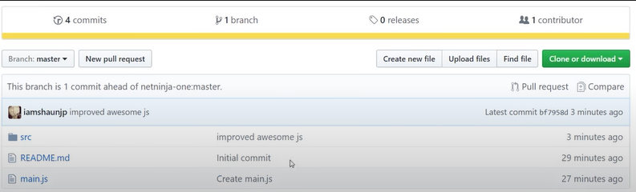
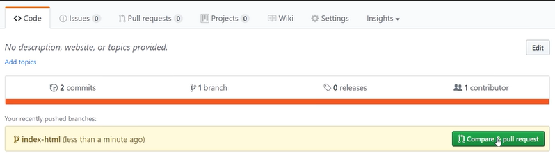
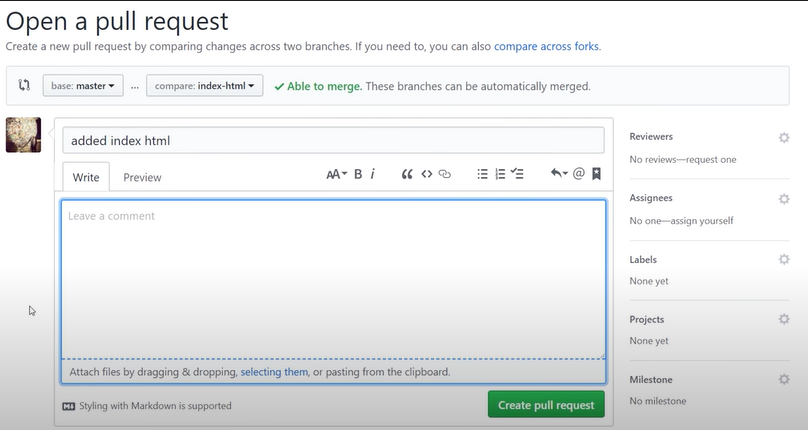
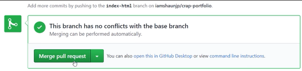

# Development Instructions

## Running the Project Locally

1. **Clone the project into the QGIS plugins folder:**
    - To locate the folder, open QGIS and navigate to `Settings > User profiles > Open Active Profile Folder`. The plugins folder is located within the `python/plugin` folder.

2. **Set up the `QGISDIR` environment variable:**  
   Point the `QGISDIR` variable to the plugins folder.

3. **Create a Python environment:**  
   Set up and activate a Python environment in your project through the terminal.

4. **Modify the interface using QT Designer:**
    - Open the QT Designer installed by QGIS.
    - Open the `intelli_geo_dockwidget_base.ui` file.
        - Make modifications.
        - Save the file.

5. **Compile the interface using `pb_tool`:**
    - Install `pb_tool` using pip:
        ```bash
        pip install pb-tool
        ```
    - Install `pyqt5ac` using pip:
        ```bash
        pip install pyqt5ac
        ```
    - On Linux, due to a [known issue](https://github.com/qgis/QGIS/issues/48368#issuecomment-1293898268), installing Qt via pip may cause incompatibility with QT5. The solution is to install the following packages:
        ```bash
        sudo apt-get install python3-pyqt5
        sudo apt-get install qtcreator pyqt5-dev-tools
        sudo apt-get install qttools5-dev-tools
        ```
    - Verify if `pb_tool.exe` is located in the Python environment’s scripts folder.
    - Navigate to the `intelli_geo` module folder in the terminal and run:
        ```bash
        pbt compile
        ```

6. **Activate the plugin in QGIS:**
    - In QGIS, go to `Plugins > Manage and Install Plugins`.
    - Select the "Installed" tab and check the box next to IntelliGeo.
    - Close the plugins manager, and the IntelliGeo menu should appear in the Plugins menu.

## Contributing to the Project - External Contributors

If you want to contribute to the IntelliGeo project but are not part of the team, follow these steps to fork the repository:

1. Go to the [IntelliGeo repository](https://github.com/MahdiFarnaghi/intelli_geo) on GitHub.

2. In the top-right corner, click **Fork**. For more information, see the [GitHub Forking Guide](https://docs.github.com/en/pull-requests/collaborating-with-pull-requests/working-with-forks/fork-a-repo).

   

3. Clone the forked repository to your local machine, make changes, and commit them to your forked repository.

4. To propose your changes to the main IntelliGeo repository, create a pull request:
   - On your forked repository, click **New pull request**.

   

   GitHub will check for merge conflicts, but only the IntelliGeo team can approve or merge changes.

## Contributing to the Project - Team Members

1. **Pull the latest version of the `main` branch:**
    ```bash
    git checkout main
    git pull origin main
    ```

2. **Create a new branch:**
    ```bash
    git checkout -b <new_branch_name>
    ```

3. **Make your changes.**

4. **Stage your changes:**
    ```bash
    git add .
    ```

5. **Commit your changes:**
    ```bash
    git commit -m "Detailed message about the changes"
    ```

6. **Push the branch for review:**
    ```bash
    git push origin <new_branch_name>
    ```

7. On GitHub, you will see the new branch. Use the **Compare & pull request** button to initiate a pull request with the `main` branch.

   

8. In the **Open a pull request** window, add a description, select reviewers, and click **Create pull request**.

   

9. The team will review the changes. If approved, they will merge the branch into the `main` branch using the **Merge pull request** button.

   

10. Optionally, delete the old branch after merging.

## Documentation

The project's documentation is managed using **MkDocs**. Documentation is generated from the `.md` files in the `docs` folder, with settings configured in `mkdocs.yml` at the root of the repository.

### Testing the Documentation Locally

To test the documentation locally, follow these steps:

1. Install the required packages by running:
```bash
pip install -U mkdocs mkdocs-material mkdocs-bootswatch mkdocs-ultralytics-plugin
```
2. Navigate to the `IntelliGeo` folder, then start the local server with:
```bash
mkdocs serve
```

This will start a local server and make your site available at `http://127.0.0.1:8000/`. Open this URL in your browser to view the documentation.

### Building the Site

The build process is automated via GitHub Actions. You can review the workflow in `.github/workflows/deploy.yml`.

To check the workflow prior to pushing it on GitHub, we use [act](https://nektosact.com/introduction.html#introduction).

## Development Roadmap

### Known Issues & Discussions

IntelliGeo team have noticed that Cohere language models are not very stable and likely to crash when they update backend services. In that sense, we suggest you to use openai when there are problems with Cohere.

If you meet any bug or issue with using our plugin, you can go to our issue list on github repository and check if there are any existing issues, if not you can post a new one. We are a very small team so we can not update the plugin very fast, we will try to react as fast as we can.
